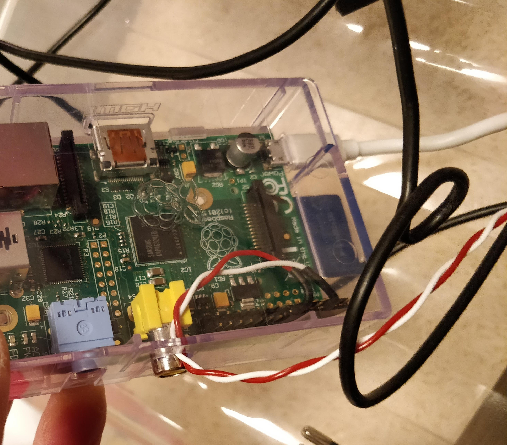

# Blendserv

## What is it?
Blendserv is a simple webserver that runs on a Raspberry Pi. It allows toggling an alarm-light siren with http requests. Perfect for some extra fun when deploying new code in production.

## Usage
- Make a POST request at http://your-raspberry-pi-IP-address:8192 with the credentials 
defined in `blendserv.py`. This will toggle the siren for 4 seconds. 
- Make a GET request to get the current status of the siren.

## Requirements
- A Raspberry Pi with Raspbian installed
- A siren that can be attached to the GPIO pins of your Raspberry pi. The original author of this forked repository added some extra electronics to a siren bought from Ali Express. Pictures can be found in the `pics` folder.
- Python3 installed
- The python package `gpiozero` installed
 
## Installation
1. Copy the file `server/blendserv.py` in the folder `/home/pi/blendserv/server/`
2. Place the file `server/blendserv.service` in `/lib/systemd/system/`
4. Install blendser.service  by running `sudo systemctl enable blendserv`
5. Run` sudo systemctl start blendserv`

Don't hesitate to have a look into the two files to adjust things like the user/password, the network port used and the siren-toggling duration

